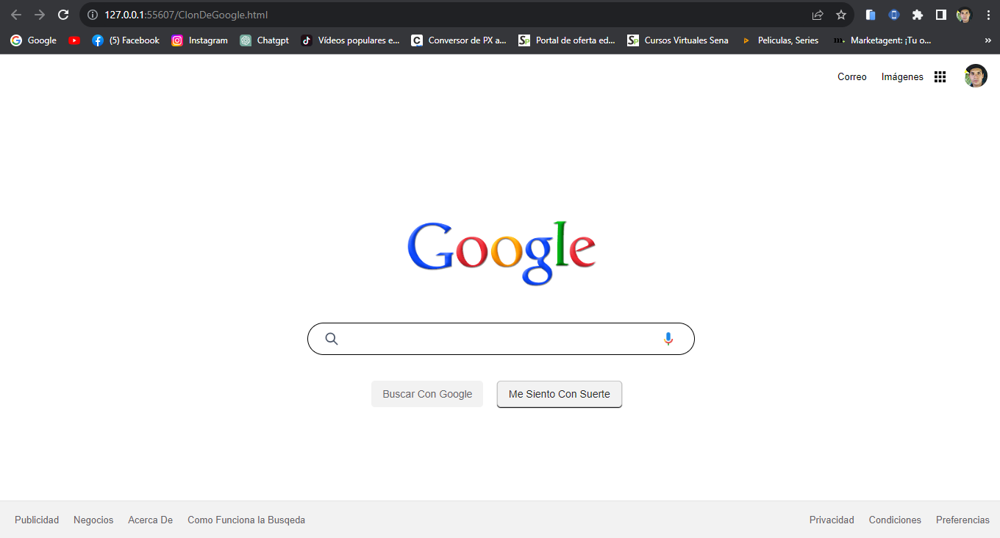

# Desafio - Clon de Google

Este es el repositorio del desafío "Clon de Google"  En este proyecto, he construido un clon de la página de inicio de Google siguiendo el diseño proporcionado, con las habilidades y el aprendizaje en cada lenguaje.

## Descripción

El desafío consiste en crear una página similar a inicio de Google, utilizando HTML y CSS. A través de este proyecto, los usuarios pueden ver el diseño optimizado para diferentes tamaños de pantalla y experimentar los estados de hover y focus en elementos interactivos.

## Tecnologías Utilizadas

- HTML
- CSS
- Google Fonts

## Cómo Iniciar

1. Clona este repositorio en tu máquina local.
2. Abre el archivo `index.html` en tu navegador web para ver el resultado.

## Vista Previa

### Enlaces

- [Ver sitio en vivo](https://cristianaguilar-dev.github.io/Clon-Google-Pagina-Inicio/)

## Desafíos y Aprendizaje

Durante este proyecto, enfrenté desafíos al alinear elementos correctamente y lograr que se asemejen al diseño proporcionado. Además, aprendí a utilizar flexbox para la disposición de elementos y a aplicar estilos de forma coherente.

## Dificultades Superadas

Una de las dificultades que superé fue ajustar los tamaños y espaciados para que coincidieran con el diseño. También me enfrenté al desafío de asegurarme de que los estados de hover y focus fueran precisos y se aplicaran correctamente.

## Lecciones Aprendidas

Este proyecto me ayudó a fortalecer mis habilidades en maquetación y estilización. Aprendí a trabajar con diseños estáticos en formato JPG y a optimizar los activos para diferentes tamaños de pantalla.

## Comentarios y Mejoras

Agradezco cualquier comentario o sugerencia para mejorar mi código y enfoque en futuros proyectos similares.

## Agradecimientos

Gracias a la comunidad del aprendizaje autodidacta por proporcionar desafíos realistas que me permiten aplicar y mejorar mis habilidades en desarrollo web.

¡Espero que disfruten explorando este proyecto tanto como yo disfruté construyéndolo!
